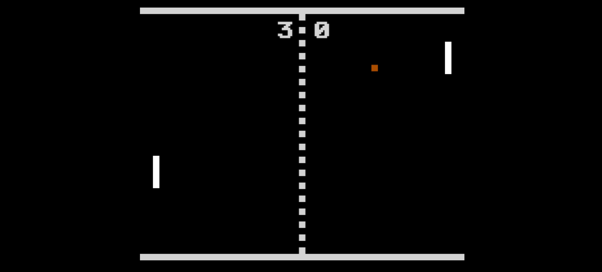

<h1 align="center">Pong 🏓</h1>

<p align="center">
  

  

  

  

  
</p>


<p align="center">
  <a href="#dart-about">About</a> &#xa0; | &#xa0; 
  <a href="#sparkles-features">Features</a> &#xa0; | &#xa0;
  <a href="#rocket-technologies">Technologies</a> &#xa0; | &#xa0;
  <a href="#white_check_mark-requirements">Requirements</a> &#xa0; | &#xa0;
  <a href="#checkered_flag-starting">Starting</a> &#xa0; | &#xa0;
  <a href="#memo-license">License</a> &#xa0; | &#xa0;
  <a href="https://github.com/BenoitPrmt" target="_blank">Author</a>
</p>

<br>



## :dart: About ##

The Pong game in JavaScript with canvas API.
Player left :
- Up : A
- Down : Q

Player right : 
- Up : ArrowUp
- Down : ArrowDown

## :sparkles: Features ##

- Play with a friend with keyboard
- Reset game

## :rocket: Technologies ##

The following tools were used in this project:

- HTML / CSS
- JavaScript
- [canvas](https://developer.mozilla.org/fr/docs/Web/API/Canvas_API)

## :white_check_mark: Requirements ##

Before starting 🏁, you need to have [Git](https://git-scm.com).
You need to install the font in the `fonts` folder to have the better experience.

## :checkered_flag: Starting ##

```bash
# Clone this project
$ git clone https://github.com/BenoitPrmt/Pong-Game

# Access
$ cd Pong-Game

# Launch the project with VSCode Live Server or launch the index.html file in browser
```

## :memo: License ##

This project is under license from MIT. For more details, see the [LICENSE](LICENSE.md) file.


Made with :heart: by <a href="https://github.com/BenoitPrmt" target="_blank">Benoît</a>

&#xa0;

<a href="#top">Back to top</a>
